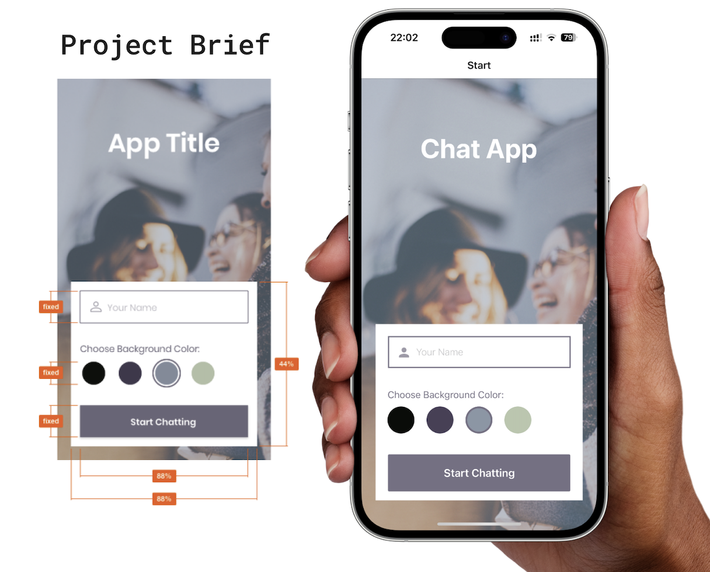
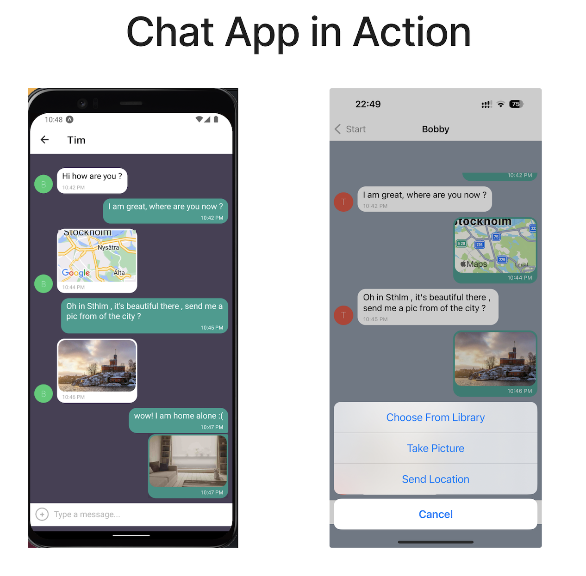

# React Native Mobile Chat App

## Project Brief

## Approach

In this project, I closely followed the design brief to meet every job requirement with care and precision. My focus was on understanding the details and making sure the final work would would be delivered as orderd.

## Objective

To develop a mobile chat application using React Native, providing a user-friendly chat interface with image and location sharing capabilities.

## Design Specifications

- Vertical and horizontal spacing: evenly distributed
- App title: font size 45, font weight 600, font color #FFFFFF
- “Your name”: font size 16, font weight 300, font color #757083, 50% opacity
- “Choose background color”: font size 16, font weight 300, font color #757083, 100% opacity
- Color options HEX codes: #090C08; #474056; #8A95A5; #B9C6AE
- Start chatting button: font size 16, font weight 600, font color #FFFFFF, button color #757083

## Technical Requirements

- Written in React Native and developed using Expo.
- Utilizes Google Firestore Database for storing chat conversations.
- Google Firebase authentication for anonymous user authentication.
- Local storage of chats.
- Integration with phone's image library and camera for image sharing.
- Ability to read user's location data and share it in the chat.

## Features

- Easy-to-use chat room access for new users.
- Options for users to send messages, share images, and locations.
- Offline message access.
- Compatibility with screen readers for visually impaired users.
- Online and offline data storage.

## Chat App In Action - Android / IOS

## Installation and Setup

(Instructions on installation and setup)

## Contributing

(Guidelines for contributing to the project)

## License

## Design and Accessibility

( in progress)
